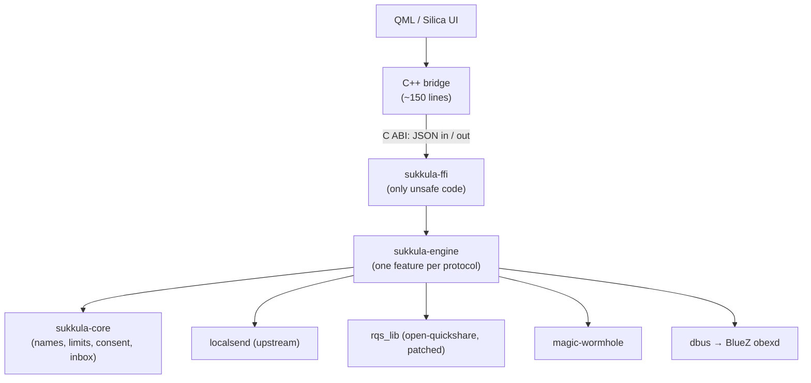

# Sukkula — Specification v0.2

Sep 24, 2026 · @Philipp

v0.2 renames Parvi to Sukkula and settles every open decision of v0.1 (§8). Where
the implementation departs from v0.1 the change is marked **(v0.2)**.

## 1. Purpose, scope and name

Sukkula is a GPL-3.0-or-later Sailfish OS app for the Jolla Phone 2026, distributed only through Jolla's Harbour store -- never OpenRepos, never Chum **(v0.2)** -- that sends and receives files and text over four protocols from one UI.

**Name:** *Sukkula* (Finnish for "shuttle" -- the loom's and the space kind; say SOOK-koo-lah). It carries things back and forth, which is the whole app. Package and binary name: `harbour-sukkula`. **(v0.2)**

**In scope (v1.0):**

| Protocol | Send | Receive | Peer needs |
| --- | --- | --- | --- |
| LocalSend v2 | Yes | Yes | LocalSend app, same LAN |
| Quick Share | Yes | Yes | Stock Android, same LAN (BLE only for discovery) |
| Magic Wormhole v1 | Yes | Yes | Any wormhole client, internet |
| Bluetooth OBEX Object Push | Yes | No (system handles it) | Bluetooth |

Sukkula also registers as a target in the system Share menu, so any app can hand it files.

**Non-goals:** AirDrop; Wi-Fi Direct and hotspot upgrades; LocalSend WebRTC and browser-share modes; receiving when the app is closed (no daemon, no autostart); unpacking archives or folders; clipboard sync; opening received URLs or files automatically.

## 2. Platform and Harbour constraints

Every package must pass `sfdk check -s harbour`; anything the validator rejects is out of scope, not worked around.

- **Targets:** aarch64 only, Sailfish OS 5.2 and later, which is the Jolla Phone 2026 and nothing else. No armv7hl, no i486, no compatibility code for older releases. **(v0.2)**
- **Sailjail permissions:** `Internet;Bluetooth;Downloads` and nothing else. `Bluetooth` grants BlueZ on the system bus (`org.bluez`) and obexd on the session bus (`org.bluez.obex`), which is everything Bluetooth and the Quick Share BLE nudge need. Received files go to `~/Downloads/Sukkula/`, staged in `~/Downloads/Sukkula/.partial/` (see S3); files to send arrive via the Share menu or a file picker.
- **Linked system libraries** (all on the Harbour allow-list): Qt5 Core/Gui/Qml/Quick/DBus, libsailfishapp, libdbus-1.so.3, libz. Everything else is statically linked Rust.
- **QML imports:** Sailfish.Silica, Sailfish.Share (ShareProvider), Sailfish.Pickers, Nemo.KeepAlive, Nemo.Notifications. QtBluetooth is not allowed, so BlueZ is reached over raw D-Bus from Rust.
- **Lifecycle:** receiving only while the app runs (cover page shows "Receiving"). KeepAlive holds the CPU awake during an active transfer only.
- **Network:** inbound TCP (LocalSend 53317, Quick Share random port) must survive Sailfish's connman firewall. Verify on hardware in milestone 1; if blocked, document it and stop.

## 3. Architecture

All logic lives in Rust; C++ is limited to a start-up shim and one bridge class, because Silica and libsailfishapp must be booted from C++.

Arrows show call direction; events flow back up the same path.

**Crates (three, no more without a written reason):**

- `sukkula-core`: every untrusted value passes through here. It sanitises names and display text, enforces limits, runs the consent broker and writes files. It has no network code and `#![forbid(unsafe_code)]`.
- `sukkula-engine`: thin adapters that translate each protocol library's events into core types. Each protocol is a Cargo feature so it can be built and tested alone.
- `sukkula-ffi`: `staticlib` with four C functions: `sukkula_start(config_json, callback, userdata)`, `sukkula_command(handle, json)`, `sukkula_stop(handle)`, `sukkula_version()`. Every entry point wraps `catch_unwind`; strings passed to the callback are valid only during the call.

**Commands and events** are versioned JSON with serde `deny_unknown_fields`, capped at 64 KiB. A panic in a connection task kills that task only (`panic = "unwind"`), never the app.

**Toolchain:** the Sailfish SDK ships Rust 1.75 at most, while magic-wormhole 0.8 needs 1.92 and open-quickshare uses edition 2024. The Rust part is therefore cross-compiled with a pinned upstream toolchain (`rust-toolchain.toml`, 1.97.1, the LocalSend core's own pin **(v0.2)**) against the Sailfish target sysroot, with the SDK's own aarch64 GCC. `sfdk` then builds the C++/QML shell, links the static library and makes the RPM. Harbour validates the RPM, not the compiler used.

## 4. Functional requirements

Each requirement has an ID; every ID gets at least one automated test or a named manual test on hardware.

**Common (F-C)**

- **F-C1** One Receive switch turns all enabled receivers on or off together; each protocol can be disabled in Settings.
- **F-C2** Every incoming offer shows a consent dialog: sanitised sender name, protocol, file names, sizes and total. There is no auto-accept, not even for known devices.
- **F-C3** Unanswered offers are declined after 60 s. At most 2 offers wait at once; further ones are declined without UI.
- **F-C4** Received text is shown as plain text with a Copy button. URLs are never opened automatically.
- **F-C5** Progress, success and failure are shown per transfer; any transfer can be cancelled.
- **F-C6** Sukkula appears in the system Share menu (ShareProvider) for files and text, and opens a "Send via…" page.
- **F-C7** The device name shown to peers defaults to the device model and can be edited.

**LocalSend (F-LS)**, via the upstream `localsend` crate, protocol v2:

- **F-LS1** Discovery via multicast 224.0.0.167:53317, plus the HTTP register fallback. **(v0.2: the fallback registers, over HTTPS and pinned, only with servers already known -- found earlier by multicast or that registered with us -- and never scans the subnet as the upstream apps do. A phone on a network that drops multicast therefore finds only devices it has met before or that register with it.)**
- **F-LS2** HTTPS only, with a self-signed certificate generated on first run and kept in the app data dir (mode 0600). Plain HTTP peers are refused.
- **F-LS3** When sending, pin the peer's certificate to the fingerprint it announced; abort on mismatch.
- **F-LS4** Optional receive PIN, off by default.

**Quick Share (F-QS)**, via `rqs_lib` from open-quickshare:

- **F-QS1** Receive and send over Wi-Fi LAN (mDNS + TCP).
- **F-QS2** BLE advertisement so Android phones reveal their mDNS service ("nudge"), best effort: if the adapter or BlueZ can't advertise, LAN discovery still works.
- **F-QS3** Show the 4-digit PIN from the handshake in the consent dialog.
- **F-QS4** Visibility: Hidden or Everyone. Contacts-only mode is impossible without Google account keys.
- **F-QS5** Wi-Fi credential payloads are refused.

**Magic Wormhole (F-MW)**, via `magic-wormhole` 0.8, transfer protocol v1:

- **F-MW1** Send one file and show the generated code (2 words) as text and a QR code.
- **F-MW2** Receive by typing a code, then show the consent dialog before any data flows. **(v0.2: no scanning -- a camera needs the `Camera` Sailjail permission, which §2 does not grant.)**
- **F-MW3** Folder offers arrive as the sender's `.zip` and are saved unopened.
- **F-MW4** Default mailbox and relay servers, with custom URLs in Settings.

**Bluetooth (F-BT)**, via obexd over D-Bus:

- **F-BT1** Send files to a paired device over OBEX Object Push, with progress and cancel.
- **F-BT2** Receiving is left to the Sailfish system UI, since only one OBEX agent can be registered.

## 5. Security requirements

The attacker is anyone on the same Wi-Fi, within Bluetooth range, or holding a wormhole code; every byte, name, size and alias they send is hostile. Goals: no file written outside `~/Downloads/Sukkula/`, nothing accepted without consent, no crash or memory exhaustion from any input, and no spoofing in the UI.

**Rules (S)**

- **S1 Names.** Every peer-supplied file name becomes a single path component: last segment only; no `/`, `\`, NUL, control, bidi or zero-width characters; no leading dot; no trailing dot or space; at most 200 bytes with the extension kept. Unusable names become `received-file`.
- **S2 Display text.** Aliases, models and messages lose control, bidi and invisible characters and are length-capped. QML shows them with `textFormat: Text.PlainText`.
- **S3 Writes.** Only `sukkula-core`'s inbox writes files: it stages in a hidden `.partial/` directory inside the download directory **(v0.2: not the app data dir, because Sailjail's bind mounts turn a link or rename from there into `~/Downloads` into `EXDEV`)** with `O_CREAT|O_EXCL` and mode 0600, caps bytes at the declared size, checks SHA-256 when the sender supplies it, then links the file into place under a unique name, never overwriting and never following a link (a copy into an `O_EXCL` file where the file system cannot link). Partial files are deleted on any failure.
- **S4 Allocation.** Every length or size field is range-checked, including negatives, before anything is allocated or read.
- **S5 Consent first.** No payload byte is written before the user accepts.
- **S6 Limits.** 8 GiB per file, 16 GiB per offer, 500 files per offer, 64 KiB per text or JSON message; every network read has a timeout.
- **S7 Reach.** Only private, link-local or ULA addresses are answered on the LAN protocols; discovery replies are rate-limited per IP.
- **S8 No side effects.** No process spawning, no shell, no URL or file opening, no Wi-Fi changes.
- **S9 Secrets.** The TLS key has mode 0600 and is never logged. Logging is off by default and never includes file names or text at info level.
- **S10 Code.** `unsafe` only in `sukkula-ffi`. Clippy denies `unwrap`, `expect`, `panic`, unchecked indexing and unchecked arithmetic in our crates. Overflow checks are on in release builds.

**Upstream findings.** Reading open-quickshare at commit `5a31145` turned up issues that must be patched before use, and reported upstream first:

| # | Issue | Effect | Fix |
| --- | --- | --- | --- |
| Q1 | Peer file name joined onto the download dir unsanitised | `../` or absolute names write outside Downloads (within the sandbox) | Apply S1 |
| Q2 | `exists()` check, then `File::create` | Race; truncates files and follows symlinks | `create_new` |
| Q3 | Negative payload size passes the 5 MiB check | Oversized allocation, panic | Reject sizes below 0 |
| Q4 | Byte-payload buffer grows past the declared size | Memory exhaustion before consent | Cap at declared size |
| Q5 | Negative file sizes wrap the total | Wrong total in the consent dialog | Reject sizes below 0 |
| Q6 | Wi-Fi Direct upgrade joins peer-chosen networks via `nmcli` | Network changes driven by the peer | Compile out |
| Q7 | `dbus` built with `vendored` on aarch64 | Static libdbus, not the system copy | Use system libdbus |

The patched copy lives in `third_party/` with the patches kept separate, so we can drop them as upstream merges fixes. Sukkula still routes every Quick Share file through S1 and S3 as a second layer.

The upstream LocalSend core already sanitises names and verifies client certificates. Sukkula still takes its data as a stream and writes it through its own inbox. For magic-wormhole, Sukkula uses only the v1 transfer API, because the v2 accept path contains `panic!`/`expect` on unexpected offer shapes.

## 6. Dependencies and licensing

Sukkula writes adapters, not protocols: each protocol comes from one maintained library, and our own dependencies stay close to this list.

| Crate | Purpose | Licence | Source |
| --- | --- | --- | --- |
| [localsend](https://github.com/localsend/localsend) (core) | LocalSend v2 server, client, discovery | Apache-2.0 | git, pinned rev `e768240` |
| [rqs\_lib](https://github.com/ignotusbucius/open-quickshare) | Quick Share | GPL-3.0 | vendored + patches |
| [magic-wormhole](https://github.com/magic-wormhole/magic-wormhole.rs) | Wormhole | EUPL-1.2 | crates.io `=0.8.1` |
| dbus | BlueZ obexd | MIT/Apache-2.0 | crates.io |
| tokio, serde, serde\_json, thiserror, sha2, tracing | Runtime and plumbing | MIT/Apache-2.0 | crates.io |
| proptest, tempfile (dev only) | Tests | MIT/Apache-2.0 | crates.io |

Sukkula itself is GPL-3.0-or-later. EUPL-1.2 allows distribution under GPL-3.0 through its compatibility appendix, and Apache-2.0 and MIT are GPL-3.0 compatible.

**Policy**

- `Cargo.lock` is committed; git dependencies are pinned to a commit; builds are offline (`cargo vendor`).
- `cargo deny` runs in CI and checks licences against an allow-list, RustSec advisories, duplicate versions and permitted sources. Any advisory exception needs a written reason in `deny.toml`.
- Adding a dependency needs a one-line reason in the PR. Anything that pulls a second async runtime, TLS stack or D-Bus stack needs a design note.
- Known exceptions: the LocalSend core pulls `rsa` (flagged by RUSTSEC-2023-0071, the Marvin timing attack), used only for key generation and signature verification. magic-wormhole brings the smol/async-io runtime alongside tokio. Both are accepted for v1.0 and recorded in `deny.toml`.

## 7. Testing and quality

A change merges only when CI passes: `cargo fmt --check`, `clippy -D warnings`, tests, `cargo deny`, a 60-second fuzz smoke run, the ARM cross-build, and the **Harbour gate** **(v0.2)**: `ci/harbour-check.sh` asks every question of Jolla's validator that a source tree can answer, on every pull request, and the RPM workflow runs Jolla's own `rpmvalidation.sh` (`sfdk check -s harbour`) on the built package. `docs/HARBOUR.md` has both.

| Layer | What | Tool |
| --- | --- | --- |
| Core | Every S-rule as a property test (names, display text, inbox caps and cleanup) | proptest |
| Adapters | Loopback transfers per protocol: Sukkula to Sukkula, and Sukkula to the reference client on the same host (LocalSend CLI, `wormhole` CLI, rquickshare) **(v0.2: LocalSend against the upstream core's own client and server; `wormhole` against the pinned Python client in CI's `wormhole-interop` job; no rquickshare interop yet -- Quick Share is Sukkula to Sukkula over the patched library plus hand-built frames, and real Android peers are M-30)** | cargo test (integration) |
| Hostile input | Malicious peers replaying Q1–Q5 and S1–S7 cases: traversal names, negative and oversized sizes, endless chunks, bidi aliases, slow senders | cargo test with hand-built frames |
| Parsers | FFI command JSON, LocalSend DTOs, Quick Share frames, wormhole offers | cargo-fuzz, corpus in repo |
| FFI | Start/stop cycles, bad UTF-8, oversize commands, callback on a foreign thread | cargo test + a small C harness under ASan |
| Device | Manual checklist per release on the Jolla Phone 2026, against Pixel, Samsung, LocalSend iOS/desktop and Bluetooth | Named test IDs M-1… (`docs/MANUAL-TESTS.md`) |

Coverage target: every F- and S-requirement links to at least one test; `sukkula-core` reaches 90 % line coverage (`cargo llvm-cov`).

**Milestones**

1. M1 (walking skeleton): repo, CI, core crate, FFI, QML shell that starts and stops. The Harbour validator passes and the firewall question is answered on hardware.
2. M2: LocalSend send and receive.
3. M3: Magic Wormhole send and receive.
4. M4: Quick Share LAN, patches upstreamed or vendored, then the BLE nudge.
5. M5: Bluetooth send, Share-menu integration, translations (en, fi, de, sv), Harbour submission.

## 8. Decisions (v0.2)

Settled on Sep 24, 2026. Each replaces the corresponding open question of v0.1.

- [x] **Name:** Sukkula (`harbour-sukkula`).
- [x] **Distribution:** Harbour only. No OpenRepos, no Chum, and nothing in the tree that exists only for them.
- [x] **Toolchain:** pinned upstream Rust 1.97.1 cross-compiling against the SDK sysroot. The SDK's Rust is not used.
- [x] **LocalSend:** the upstream core at `e768240`, with `rsa` recorded in `deny.toml`.
- [x] **Wormhole:** our own adapter over `magic-wormhole` 0.8.1.
- [x] **Plain-HTTP LocalSend peers:** refused, with no setting to allow them.
- [x] **Limits:** 8 GiB per file, 16 GiB per offer, 500 files, as in S6.
- [x] **Minimum OS:** Sailfish OS 5.2 on the Jolla Phone 2026. Nothing older, and no other device.
- [x] **Hosting and CI:** GitHub and GitHub Actions; the `sfdk` build runs in the Sailfish SDK container on Actions.
