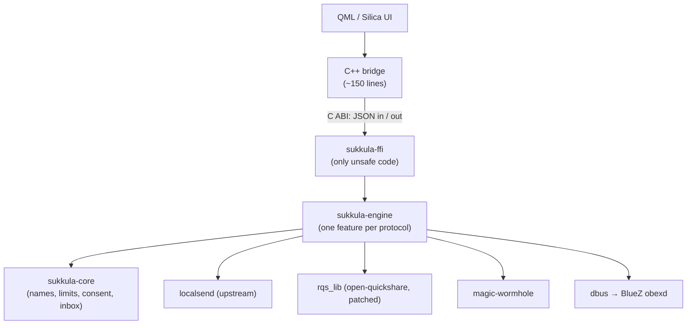

# Sukkula — Specification v0.7

Sep 24, 2026 · @Philipp

v0.2 renames Parvi to Sukkula and settles every open decision of v0.1 (§8). Where
the implementation departs from v0.1 the change is marked **(v0.2)**.

v0.3 (Sep 25, 2026) ships the engine as a private shared library instead of
linking it into the binary, after the first phone test (`docs/FFI.md`,
Linking). The changes are marked **(v0.3)**.

v0.4 (Sep 26, 2026) makes Send and Receive the two modes of one main page,
with every way of sending on one send screen. The changes are marked
**(v0.4)**.

v0.5 (Sep 26, 2026) makes the two modes tabs at the top of the main page,
gives Receive mode a radar of its own, moves the transfers and received
texts to a History page, and grants the Sailjail permissions for sending
from the user's folders and memory cards. It adds croc as a fifth
protocol, over the internet like Magic Wormhole (§4, F-CR). The changes
are marked **(v0.5)**.

v0.6 (Sep 27, 2026) receives Magic Wormhole and croc codes by scanning the
QR code on the sender's screen, and shows croc's code as a QR code too. It
grants the `Camera` Sailjail permission and the `QtMultimedia` QML import,
adds a fifth C function, `sukkula_scan_qr`, and a second C++ class, the
scanner, and vendors rqrr as the QR decoder. The changes are marked
**(v0.6)**.

v0.7 (Sep 27, 2026) redesigns both tabs for people who have never heard
of any of the protocols: Silica lists in place of the radars, the
protocol only ever in the grey line. Send asks what (four tiles, each
opening the platform's own picker) and then to whom (the devices nearby
by name, then sending with a code on a page of its own); Receive shows
at one glance whether the phone is ready, what comes in, and what came
today. Sukkula sends files only. Receiving stops a few seconds after the
app leaves the front, and the cover offers Send and Receive. It grants
the `MediaIndexing` Sailjail permission for the pickers, and `peer_found`
says where a device is and, for LocalSend, the certificate it proved.
The changes are marked **(v0.7)**.

## 1. Purpose, scope and name

Sukkula is a GPL-3.0-or-later Sailfish OS app for the Jolla Phone 2026, distributed only through Jolla's Harbour store -- never OpenRepos, never Chum **(v0.2)** -- that sends and receives files and text over four protocols from one UI. **(v0.5: five, with croc.)** **(v0.7: it sends files only; texts other devices send are still received, F-C4.)**

**Name:** *Sukkula* (Finnish for "shuttle" -- the loom's and the space kind; say SOOK-koo-lah). It carries things back and forth, which is the whole app. Package and binary name: `harbour-sukkula`. **(v0.2)**

**In scope (v1.0):**

| Protocol | Send | Receive | Peer needs |
| --- | --- | --- | --- |
| LocalSend v2 | Yes | Yes | LocalSend app, same LAN |
| Quick Share | Yes | Yes | Stock Android, same LAN (BLE only for discovery) |
| Magic Wormhole v1 | Yes | Yes | Any wormhole client, internet |
| croc 11 and 10 **(v0.5)** | Yes | Yes | Any croc client, internet |
| Bluetooth OBEX Object Push | Yes | No (system handles it) | Bluetooth |

Sukkula also registers as a target in the system Share menu, so any app can hand it files.

**Non-goals:** AirDrop; Wi-Fi Direct and hotspot upgrades; LocalSend WebRTC and browser-share modes; receiving when the app is closed (no daemon, no autostart); unpacking archives or folders; clipboard sync; opening received URLs or files automatically.

## 2. Platform and Harbour constraints

Every package must pass `sfdk check -s harbour`; anything the validator rejects is out of scope, not worked around.

- **Targets:** aarch64 only, Sailfish OS 5.2 and later, which is the Jolla Phone 2026 and nothing else. No armv7hl, no i486, no compatibility code for older releases. **(v0.2)**
- **Sailjail permissions:** `Internet;Bluetooth;Downloads` and nothing else. `Bluetooth` grants BlueZ on the system bus (`org.bluez`) and obexd on the session bus (`org.bluez.obex`), which is everything Bluetooth and the Quick Share BLE nudge need. Received files go to `~/Downloads/Sukkula/`, staged in `~/Downloads/Sukkula/.partial/` (see S3); files to send arrive via the Share menu or a file picker. **(v0.5: `Internet;Bluetooth;Downloads;Documents;Music;Pictures;Videos;RemovableMedia`. The five added are read-only in practice -- nothing is written outside `~/Downloads/Sukkula/` -- and let a file be sent from the user's folders and memory cards, whether picked in the file browser or handed over through the Share menu, where Gallery's photos come from `~/Pictures`. Not `UserDirs`, which would take in the whole home directory, and not `MediaIndexing`: the file browser needs no media index.)** **(v0.6: and `Camera`, for the page that reads a code off the sender's screen: the viewfinder runs only while that page is in front, and nothing is recorded or saved.)** **(v0.7: and `MediaIndexing`, for the platform's pickers of photos, videos and documents (F-C6), which list what the media index knows. The index gives names and places; Sukkula reads no more of it than the pickers show, and the file browser for any file still needs none.)**
- **Linked system libraries** (all on the Harbour allow-list): Qt5 Core/Gui/Qml/Quick/DBus, libsailfishapp, libdbus-1.so.3, libz. Everything else is Rust, statically linked into one private library, `/usr/share/harbour-sukkula/lib/libsukkula_ffi.so`, which the binary finds through its RPATH **(v0.3: not into the binary itself. The `silica-qt5` booster `dlopen()`s the binary, and an executable's thread-locals are resolved to fixed offsets that a `dlopen()`ed one does not get.)**
- **QML imports:** Sailfish.Silica, Sailfish.Share (ShareProvider), Sailfish.Pickers, Nemo.KeepAlive, Nemo.Notifications. QtBluetooth is not allowed, so BlueZ is reached over raw D-Bus from Rust. **(v0.6: and QtMultimedia 5.6, for the scan page's Camera and VideoOutput alone.)** **(v0.7: Sailfish.Share's ShareAction too, to hand a code to send with to the share sheet as text; Sailfish.Pickers' dialogs for several photos, videos and documents beside the file browser's.)**
- **Lifecycle:** receiving only while the app runs (cover page shows "Receiving"). KeepAlive holds the CPU awake during an active transfer only. **(v0.7: and only while the app is in use: 5 s after it leaves the front, receiving stops as discovery does, unless an offer waits for its answer or a transfer comes in, and it starts again when the app comes back on the Receive tab. The cover shows nobody's name. With nothing going on it is split into Send and Receive, each over its own cover action, which opens the app on that tab; while it shows, Sukkula announces nothing and listens for nothing. An offer waiting shows as such, with the seconds left and no action -- accepting always goes through the consent dialog. A transfer running shows as one ring with its percentage inside, which way it goes, and how many files.)**
- **Network:** inbound TCP (LocalSend 53317, Quick Share random port) must survive Sailfish's connman firewall. Verify on hardware in milestone 1; if blocked, document it and stop.

## 3. Architecture

All logic lives in Rust; C++ is limited to a start-up shim and one bridge class, because Silica and libsailfishapp must be booted from C++. **(v0.6: and the scanner, which only moves camera frames to the engine: a QML item's pixels can reach C++ and no further.)**

```mermaid
flowchart TD
  QML["QML / Silica UI"] --> BR["C++ bridge<br/>(~150 lines)"]
  BR -- "C ABI: JSON in / out" --> FFI["sukkula-ffi<br/>(only unsafe code)"]
  FFI --> ENG["sukkula-engine<br/>(one feature per protocol)"]
  ENG --> CORE["sukkula-core<br/>(names, limits, consent, inbox)"]
  ENG --> LS["localsend (upstream)"]
  ENG --> QS["rqs_lib (open-quickshare, patched)"]
  ENG --> MW["magic-wormhole"]
  ENG --> DB["dbus → BlueZ obexd"]
```

Arrows show call direction; events flow back up the same path.

**Crates (three, no more without a written reason):**

- `sukkula-core`: every untrusted value passes through here. It sanitises names and display text, enforces limits, runs the consent broker and writes files. It has no network code and `#![forbid(unsafe_code)]`.
- `sukkula-engine`: thin adapters that translate each protocol library's events into core types. Each protocol is a Cargo feature so it can be built and tested alone.
- `sukkula-ffi`: a `staticlib`, linked into `libsukkula_ffi.so` **(v0.3)**, with four C functions, which are all the library exports: `sukkula_start(config_json, callback, userdata)`, `sukkula_command(handle, json)`, `sukkula_stop(handle)`, `sukkula_version()`. Every entry point wraps `catch_unwind`; strings passed to the callback are valid only during the call. **(v0.6: and a fifth, `sukkula_scan_qr(luma, width, height, stride, out, out_size)`, which reads a QR code in one grey camera frame and needs no engine. The C++ side gains one class besides the bridge, `src/scanner.cpp`, which grabs the viewfinder, makes it grey and small, and hands it to that function on a thread of its own.)**

**Commands and events** are versioned JSON with serde `deny_unknown_fields`, capped at 64 KiB. A panic in a connection task kills that task only (`panic = "unwind"`), never the app.

**Toolchain:** the Sailfish SDK ships Rust 1.75 at most, while magic-wormhole 0.8 needs 1.92 and open-quickshare uses edition 2024. The Rust part is therefore cross-compiled with a pinned upstream toolchain (`rust-toolchain.toml`, 1.97.1, the LocalSend core's own pin **(v0.2)**) against the Sailfish target sysroot, with the SDK's own aarch64 GCC. `sfdk` then builds the C++/QML shell against the engine's library and makes the RPM, which ships both **(v0.3)**. Harbour validates the RPM, not the compiler used.

## 4. Functional requirements

Each requirement has an ID; every ID gets at least one automated test or a named manual test on hardware.

**Common (F-C)**

- **F-C1** One Receive switch turns all enabled receivers on or off together; each protocol can be disabled in Settings. **(v0.4: the switch is the Send \| Receive mode at the foot of the main page. Receive switches every enabled receiver on; Send switches them off and runs discovery instead, while the app is in front: after 5 s in the background discovery pauses, and it resumes when the app comes back. The mode shown is the engine's state, so the cover's action changes it too.)** **(v0.5: Send and Receive are two tabs at the top of the main page, tapped or swiped between, and the page stays in portrait. Receive mode is a radar like Send mode's: this phone at the centre with the name others see, the rings pulsing while it is visible, and a device that offers something on the rings while the consent dialog asks; an accepted transfer draws a line from the sender to the centre and both fill as it comes. The cloud above holds the tiles to receive with a code.)** **(v0.6: a QR code icon takes the cloud's place, and receiving with a code starts there: see F-MW2.)** **(v0.7: the radars are gone. The tab is the mode while the app is in front; see §2's Lifecycle for the background. The Receive tab says whether the phone is ready, with the name others see (changed in Settings) and rings pulsing round it; under "From far away", "Scan a code" opens F-MW2's page; under "Received today", one row per transfer -- files that came together are one row ("3 photos") that lists them on a page of their own, where they went said once. At the foot, folded away, "How others can reach this phone": one row per way, named by who it reaches -- Android phones (Quick Share), computers and other phones (LocalSend), anyone with a code (Magic Wormhole, croc), Bluetooth -- with its state, a failure in red, and a tap to its Settings. In Settings the switches are grouped the same way, "Nearby" and "Far away", one's own servers folded away.)**
- **F-C2** Every incoming offer shows a consent dialog: sanitised sender name, protocol, file names, sizes and total. There is no auto-accept, not even for known devices. **(v0.7: the sender big, then what and how in Sukkula's words -- "wants to send you 3 photos over Quick Share" -- the PIN in a box of its own, and one file big by itself or several listed under their count and total, with the countdown as a line running down. A file's kind is told by its name alone and drawn as an icon: nothing offered is ever shown as a picture.)**
- **F-C3** Unanswered offers are declined after 60 s. At most 2 offers wait at once; further ones are declined without UI.
- **F-C4** Received text is shown as plain text with a Copy button. URLs are never opened automatically.
- **F-C5** Progress, success and failure are shown per transfer; any transfer can be cancelled. **(v0.5: on the radars while a transfer runs and a few seconds after, and on the History page, reached from either tab's pulley menu, for every transfer of the session and the received texts.)** **(v0.7: in the row of the device sent to, and under the Receive tab's "Receiving", in place of the radars: the percentage big with a cross beside it, a progress line, how much of how much and roughly how long is left.)**
- **F-C6** Sukkula appears in the system Share menu (ShareProvider) for files and text, and opens a "Send via…" page. **(v0.4: there is no separate page. Send mode shows every way of sending on one screen, in portrait only: this phone at the centre of a radar of round rings, holding what is to be sent; the LocalSend and Quick Share peers discovery finds and the paired Bluetooth devices on its rings, as many as fit without covering each other and the rest behind "+N", each with a protocol badge; above them a cloud with Magic Wormhole's tile, and a tile kept for croc. A share opens Send mode with its items at the centre; tapping a peer sends, with the file picker first if nothing is chosen. A running send draws a line from the centre to its peer -- through the cloud for Magic Wormhole -- and both fill as it goes.)** **(v0.5: until something is chosen, the centre -- a plus, which opens the file browser, several files at a time -- is all there is; discovery runs meanwhile, and the peers and the cloud appear with the first file. The cloud's tiles come out when it is tapped. Tapping the centre again adds files, and a cross beside it clears them. Texts come from the Share menu only.)** **(v0.7: files only: the Share menu's method for text is gone. With nothing chosen, the tab asks what to send, with four tiles -- Photos and Videos (Gallery's pickers), Documents (the documents list), Any file (the file browser) -- and says at its foot who is nearby, since discovery already runs. With files chosen, a row says what they are ("3 photos", 8.2 MB) with + to add more and a cross to clear them behind a remorse; under "Nearby", every device by name, a device found over Quick Share and LocalSend by the same name one row whose long-press menu says which way to send (the tap sends the first) and opens "About this device": what each way says, its address, and for LocalSend the certificate every send is pinned to (F-LS3). The paired Bluetooth devices come last. Under "Far away", "Send with a code" (F-MW1, F-CR1). Tapping a device sends at once; its row shows the send and the others wait. After a send the files stay chosen, for another device.)**
- **F-C7** The device name shown to peers defaults to the device model and can be edited.

**LocalSend (F-LS)**, via the upstream `localsend` crate, protocol v2:

- **F-LS1** Discovery via multicast 224.0.0.167:53317, plus the HTTP register fallback. **(v0.2: the fallback registers, over HTTPS and pinned, only with servers already known -- found earlier by multicast or that registered with us -- and never scans the subnet as the upstream apps do. A phone on a network that drops multicast therefore finds only devices it has met before or that register with it.)** **(v0.5: LocalSend answers an announcement only by registering with the server it names, so while Send mode looks for devices the HTTPS server runs too, serving registrations and nothing else until Receive is on.)**
- **F-LS2** HTTPS only, with a self-signed certificate generated on first run and kept in the app data dir (mode 0600). Plain HTTP peers are refused.
- **F-LS3** When sending, pin the peer's certificate to the fingerprint it announced; abort on mismatch.
- **F-LS4** Optional receive PIN, off by default.

**Quick Share (F-QS)**, via `rqs_lib` from open-quickshare:

- **F-QS1** Receive and send over Wi-Fi LAN (mDNS + TCP).
- **F-QS2** BLE advertisement so Android phones reveal their mDNS service ("nudge"), best effort: if the adapter or BlueZ can't advertise, LAN discovery still works.
- **F-QS3** Show the 4-digit PIN from the handshake in the consent dialog.
- **F-QS4** Visibility: Hidden or Everyone. Contacts-only mode is impossible without Google account keys.
- **F-QS5** Wi-Fi credential payloads are refused.

**Magic Wormhole (F-MW)**, via `magic-wormhole` 0.8, transfer protocol v1:

- **F-MW1** Send one file and show the generated code (2 words) as text and a QR code. **(v0.7: on the page "Send with a code", which starts the send at once with Magic Wormhole for one file and croc for several: the code big, its QR code, Copy, and Share, which hands the code to the share sheet as text. "Their app" switches to the other protocol for someone whose app speaks only that one, giving the code shown up for a new one; so does leaving the page before anyone has come for the code. Once they have, the send goes on, and shows on the Send tab too.)**
- **F-MW2** Receive by typing a code, then show the consent dialog before any data flows. **(v0.2: no scanning -- a camera needs the `Camera` Sailjail permission, which §2 does not grant.)** **(v0.6: or by scanning the QR code on the sender's screen -- Warp's, Destiny's and Sukkula's `wormhole-transfer:` URI -- with the camera. The code in it is checked as a typed one is, and a mailbox server it names, checked as one in Settings is, is used for that receive.)** **(v0.6: the Receive tab's QR code icon opens one page for both protocols -- the camera's viewfinder filling it, and an Enter code button over it that opens a field to type or paste the code instead, the clipboard offered when it holds a code. Nobody is asked whether a code is Magic Wormhole's or croc's: a QR code says, and a typed code is told by its shape in the engine (`receive_code`, `docs/FFI.md`).)**
- **F-MW3** Folder offers arrive as the sender's `.zip` and are saved unopened.
- **F-MW4** Default mailbox and relay servers, with custom URLs in Settings.

**croc (F-CR) (v0.5)**, our own implementation of croc 11's protocol, and of croc 10's for its clients still about (`crates/sukkula-engine/src/croc/`; no Rust library speaks either), checked against croc v11.5.4's and v10.7.0's Go binaries:

- **F-CR1** Send files, or one text on its own **(v0.7: files only)**, and show the generated code (three words, as croc 11 makes them, which croc 10 reads alike) as text. No QR code: croc has no URI for one. **(v0.6: and as a QR code of the code alone, as croc 10 put it in its QR codes -- not croc 11's `https://getcroc.com/?code=` link, which a camera app would open, handing the code to a web server.)**
- **F-CR2** Receive by typing a code, then show the consent dialog before any data flows; the sender's file list is checked (S1-S6) before the user sees it. **(v0.6: or by scanning the sender's QR code: croc 11's web link, or a code on its own in croc's shape. A scanned code decides the protocol, as long as that protocol is switched on (F-C1). A typed code decides it too, by its shape: the page is F-MW2's.)**
- **F-CR3** croc's public relays by default -- the one the code picks, as croc 11 does -- with a custom relay and its password in Settings.
- **F-CR4** Data always goes through the relay: no LAN shortcut, no resume. Folders arrive flat, each file under its own name; symbolic links are left out.

**Bluetooth (F-BT)**, via obexd over D-Bus:

- **F-BT1** Send files to a paired device over OBEX Object Push, with progress and cancel.
- **F-BT2** Receiving is left to the Sailfish system UI, since only one OBEX agent can be registered.

## 5. Security requirements

The attacker is anyone on the same Wi-Fi, within Bluetooth range, or holding a wormhole or croc code -- and, for croc, the relay **(v0.5)**; every byte, name, size and alias they send is hostile. Goals: no file written outside `~/Downloads/Sukkula/`, nothing accepted without consent, no crash or memory exhaustion from any input, and no spoofing in the UI.

**Rules (S)**

- **S1 Names.** Every peer-supplied file name becomes a single path component: last segment only; no `/`, `\`, NUL, control, bidi or zero-width characters; no leading dot; no trailing dot or space; at most 200 bytes with the extension kept. Unusable names become `received-file`.
- **S2 Display text.** Aliases, models and messages lose control, bidi and invisible characters and are length-capped. QML shows them with `textFormat: Text.PlainText`.
- **S3 Writes.** Only `sukkula-core`'s inbox writes files: it stages in a hidden `.partial/` directory inside the download directory **(v0.2: not the app data dir, because Sailjail's bind mounts turn a link or rename from there into `~/Downloads` into `EXDEV`)** with `O_CREAT|O_EXCL` and mode 0600, caps bytes at the declared size, checks SHA-256 when the sender supplies it, then links the file into place under a unique name, never overwriting and never following a link (a copy into an `O_EXCL` file where the file system cannot link). Partial files are deleted on any failure.
- **S4 Allocation.** Every length or size field is range-checked, including negatives, before anything is allocated or read.
- **S5 Consent first.** No payload byte is written before the user accepts.
- **S6 Limits.** 8 GiB per file, 16 GiB per offer, 500 files per offer, 64 KiB per text or JSON message; every network read has a timeout.
- **S7 Reach.** Only private, link-local or ULA addresses are answered on the LAN protocols; discovery replies are rate-limited per IP.
- **S8 No side effects.** No process spawning, no shell, no URL or file opening, no Wi-Fi changes.
- **S9 Secrets.** The TLS key has mode 0600 and is never logged. Logging is off by default and never includes file names or text at info level.
- **S10 Code.** `unsafe` only in `sukkula-ffi`. Clippy denies `unwrap`, `expect`, `panic`, unchecked indexing and unchecked arithmetic in our crates. Overflow checks are on in release builds.

**Upstream findings.** Reading open-quickshare at commit `5a31145` turned up issues that must be patched before use, and reported upstream first:

| # | Issue | Effect | Fix |
| --- | --- | --- | --- |
| Q1 | Peer file name joined onto the download dir unsanitised | `../` or absolute names write outside Downloads (within the sandbox) | Apply S1 |
| Q2 | `exists()` check, then `File::create` | Race; truncates files and follows symlinks | `create_new` |
| Q3 | Negative payload size passes the 5 MiB check | Oversized allocation, panic | Reject sizes below 0 |
| Q4 | Byte-payload buffer grows past the declared size | Memory exhaustion before consent | Cap at declared size |
| Q5 | Negative file sizes wrap the total | Wrong total in the consent dialog | Reject sizes below 0 |
| Q6 | Wi-Fi Direct upgrade joins peer-chosen networks via `nmcli` | Network changes driven by the peer | Compile out |
| Q7 | `dbus` built with `vendored` on aarch64 | Static libdbus, not the system copy | Use system libdbus |

The patched copy lives in `third_party/` with the patches kept separate, so we can drop them as upstream merges fixes. Sukkula still routes every Quick Share file through S1 and S3 as a second layer.

The upstream LocalSend core already sanitises names and verifies client certificates. Sukkula still takes its data as a stream and writes it through its own inbox. For magic-wormhole, Sukkula uses only the v1 transfer API, because the v2 accept path contains `panic!`/`expect` on unexpected offer shapes.

**(v0.5)** croc is the one protocol with no library to adapt: the crates that carry its name speak protocols of their own. Sukkula implements it from croc v11.5.4's and v10.7.0's source, against Go's own test vectors, with every frame and message capped before it is read (`docs/SECURITY.md`, croc).

## 6. Dependencies and licensing

Sukkula writes adapters, not protocols: each protocol comes from one maintained library, and our own dependencies stay close to this list.

| Crate | Purpose | Licence | Source |
| --- | --- | --- | --- |
| [localsend](https://github.com/localsend/localsend) (core) | LocalSend v2 server, client, discovery | Apache-2.0 | git, pinned rev `e768240` |
| [rqs\_lib](https://github.com/ignotusbucius/open-quickshare) | Quick Share | GPL-3.0 | vendored + patches |
| [magic-wormhole](https://github.com/magic-wormhole/magic-wormhole.rs) | Wormhole | EUPL-1.2 | crates.io `=0.8.1` |
| dbus | BlueZ obexd | MIT/Apache-2.0 | crates.io |
| p256, crypto-bigint, aes-gcm, hmac, hkdf, base64, miniz\_oxide **(v0.5)** | croc: its PAKE, key and seal, and DEFLATE (croc's own curve, SIEC255, is ours) | MIT/Apache-2.0 (miniz\_oxide also Zlib) | crates.io |
| The EFF's short word list #1 **(v0.5)** | croc 11's codes, the list croc carries | CC BY 4.0 | `crates/sukkula-engine/src/croc/eff/` |
| [rqrr](https://github.com/WanzenBug/rqrr) **(v0.6)** | Reading QR codes from the camera: pure Rust, no `unsafe`, a port of quirc | (MIT OR Apache-2.0) AND ISC | vendored 0.11.0 + patches (its grouping bounded) |
| qrcode | The QR codes the code pages show | MIT/Apache-2.0 | crates.io |
| tokio, serde, serde\_json, thiserror, sha2, tracing | Runtime and plumbing | MIT/Apache-2.0 | crates.io |
| proptest, tempfile (dev only) | Tests | MIT/Apache-2.0 | crates.io |

Sukkula itself is GPL-3.0-or-later. EUPL-1.2 allows distribution under GPL-3.0 through its compatibility appendix, and Apache-2.0 and MIT are GPL-3.0 compatible. CC BY 4.0, which the FSF counts as GPL-3.0 compatible too, asks for credit, which the About page gives **(v0.5)**.

**Policy**

- `Cargo.lock` is committed; git dependencies are pinned to a commit; builds are offline (`cargo vendor`).
- `cargo deny` runs in CI and checks licences against an allow-list, RustSec advisories, duplicate versions and permitted sources. Any advisory exception needs a written reason in `deny.toml`.
- Adding a dependency needs a one-line reason in the PR. Anything that pulls a second async runtime, TLS stack or D-Bus stack needs a design note.
- Known exceptions: the LocalSend core pulls `rsa` (flagged by RUSTSEC-2023-0071, the Marvin timing attack), used only for key generation and signature verification. magic-wormhole brings the smol/async-io runtime alongside tokio. Both are accepted for v1.0 and recorded in `deny.toml`.

## 7. Testing and quality

A change merges only when CI passes: `cargo fmt --check`, `clippy -D warnings`, tests, `cargo deny`, the fuzz targets' seeds, dictionaries and build, the ARM cross-build, and the **Harbour gate** **(v0.2)**: `ci/harbour-check.sh` asks every question of Jolla's validator that a source tree can answer, on every pull request. Two checks run once a change has reached `main` rather than before it merges: every fuzz target is fuzzed every night, and the RPM workflow runs Jolla's own `rpmvalidation.sh` (`sfdk check -s harbour`) on the package built from every push -- and, before the merge, on the pull requests that change the packaging. `docs/HARBOUR.md` has both Harbour checks; `fuzz/README.md` the fuzzing.

| Layer | What | Tool |
| --- | --- | --- |
| Core | Every S-rule as a property test (names, display text, inbox caps and cleanup) | proptest |
| Adapters | Loopback transfers per protocol: Sukkula to Sukkula, and Sukkula to the reference client on the same host (LocalSend CLI, `wormhole` CLI, rquickshare) **(v0.2: LocalSend against the upstream core's own client and server; `wormhole` against the pinned Python client in CI's `wormhole-interop` job; (v0.5) croc against croc v11.5.4's and v10.7.0's Go binaries, as the peer and as the relay, in CI's `croc-interop` job; no rquickshare interop yet -- Quick Share is Sukkula to Sukkula over the patched library plus hand-built frames, and real Android peers are M-30)** | cargo test (integration) |
| Hostile input | Malicious peers replaying Q1–Q5 and S1–S7 cases: traversal names, negative and oversized sizes, endless chunks, bidi aliases, slow senders | cargo test with hand-built frames |
| Parsers | FFI command JSON, LocalSend DTOs, Quick Share frames, wormhole offers, croc's PAKE, banner, messages and file lists **(v0.5)**, camera frames and what their QR codes say **(v0.6)** | cargo-fuzz, corpus in repo |
| FFI | Start/stop cycles, bad UTF-8, oversize commands, callback on a foreign thread | cargo test + a small C harness under ASan |
| Device | Manual checklist per release on the Jolla Phone 2026, against Pixel, Samsung, LocalSend iOS/desktop and Bluetooth | Named test IDs M-1… (`docs/MANUAL-TESTS.md`) |

Coverage target: every F- and S-requirement links to at least one test; `sukkula-core` reaches 90 % line coverage (`cargo llvm-cov`).

**Milestones**

1. M1 (walking skeleton): repo, CI, core crate, FFI, QML shell that starts and stops. The Harbour validator passes and the firewall question is answered on hardware.
2. M2: LocalSend send and receive.
3. M3: Magic Wormhole send and receive.
4. M4: Quick Share LAN, patches upstreamed or vendored, then the BLE nudge.
5. M5: Bluetooth send, Share-menu integration, translations (en, fi, de, sv), Harbour submission.

## 8. Decisions (v0.2)

Settled on Sep 24, 2026. Each replaces the corresponding open question of v0.1.

- [x] **Name:** Sukkula (`harbour-sukkula`).
- [x] **Distribution:** Harbour only. No OpenRepos, no Chum, and nothing in the tree that exists only for them.
- [x] **Toolchain:** pinned upstream Rust 1.97.1 cross-compiling against the SDK sysroot. The SDK's Rust is not used.
- [x] **LocalSend:** the upstream core at `e768240`, with `rsa` recorded in `deny.toml`.
- [x] **Wormhole:** our own adapter over `magic-wormhole` 0.8.1.
- [x] **Plain-HTTP LocalSend peers:** refused, with no setting to allow them.
- [x] **Limits:** 8 GiB per file, 16 GiB per offer, 500 files, as in S6.
- [x] **Minimum OS:** Sailfish OS 5.2 on the Jolla Phone 2026. Nothing older, and no other device.
- [x] **Hosting and CI:** GitHub and GitHub Actions; the `sfdk` build runs in the Sailfish SDK container on Actions.
